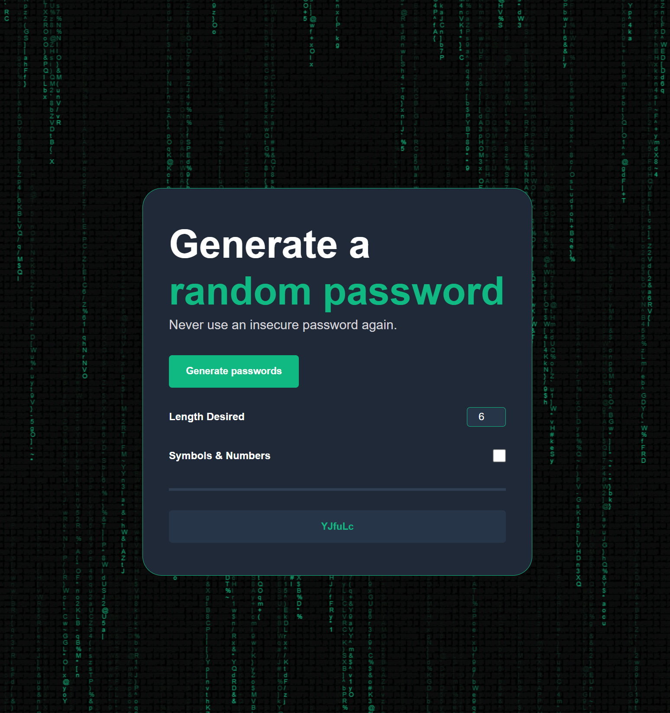

# 🔐 Random Password Generator

A modern, secure password generator with a beautiful Matrix-style animated background. Generate strong, random passwords with customizable length and character sets.


## ✨ Features

- 🎲 **Random Password Generation** - Create secure passwords instantly
- 📏 **Customizable Length** - Choose password length from 1 to 50 characters
- 🔢 **Symbol & Number Toggle** - Include or exclude special characters and numbers
- 📋 **One-Click Copy** - Copy passwords to clipboard with visual feedback
- 🎨 **Matrix Animation** - Beautiful falling characters background effect
- 📱 **Fully Responsive** - Works perfectly on desktop, tablet, and mobile devices
- 🎯 **Clean UI** - Modern, intuitive interface with smooth interactions

## 🚀 Demo

**[Live Demo](https://marwanetrk.github.io/Password-Generator/)**

## 📸 Screenshots



_A sleek password generator with Matrix-style animation_

## 🛠️ Installation

1. Clone the repository:

```bash
git clone https://github.com/marwaneTRK/Password-Generator.git
```

2. Navigate to the project directory:

```bash
cd Password-Generator
```

3. Open `index.html` in your browser or use a local server:

```bash
# Using Python
python -m http.server 8000

# Using Node.js
npx serve
```

## 💻 Usage

1. **Set Password Length**: Enter desired length (1-50 characters)
2. **Choose Character Set**:
   - Unchecked: Letters only (A-Z, a-z)
   - Checked: Letters + Numbers + Special Characters
3. **Generate**: Click "Generate passwords" button
4. **Copy**: Click the generated password to copy it to clipboard

## 🏗️ Project Structure

```
password-generator/
│
├── index.html          # Main HTML file
├── style.css           # Styling and responsive design
├── index.js            # Password generation logic
└── README.md           # Project documentation
```

## 🎨 Technologies Used

- **HTML5** - Structure
- **CSS3** - Styling and animations
- **Vanilla JavaScript** - Password generation and interactivity
- **Canvas API** - Matrix background animation

## 🔒 Security Note

This password generator creates passwords using client-side JavaScript. Passwords are generated locally in your browser and are never sent to any server. For maximum security:

- Generate passwords offline
- Use generated passwords immediately
- Don't share passwords through insecure channels
- Consider using a password manager

## 🤝 Contributing

Contributions are welcome! Here's how you can help:

1. Fork the project
2. Create your feature branch (`git checkout -b feature/AmazingFeature`)
3. Commit your changes (`git commit -m 'Add some AmazingFeature'`)
4. Push to the branch (`git push origin feature/AmazingFeature`)
5. Open a Pull Request

## 📝 License

This project is licensed under the MIT License - see the [LICENSE](LICENSE) file for details.

## 🌟 Acknowledgments

- Matrix rain animation inspired by the Matrix movie series
- Design inspired by modern web aesthetics
- Built with ❤️ for the open-source community

## 📧 Contact

Marwane Traiki - [@marwaneTRK](https://github.com/marwaneTRK)

Project Link: [https://github.com/marwaneTRK/Password-Generator](https://github.com/marwaneTRK/Password-Generator)

---

⭐ If you found this project helpful, please give it a star!

```

And here's your updated LICENSE file:
```

MIT License

Copyright (c) 2025 Marwane Traiki

Permission is hereby granted, free of charge, to any person obtaining a copy
of this software and associated documentation files (the "Software"), to deal
in the Software without restriction, including without limitation the rights
to use, copy, modify, merge, publish, distribute, sublicense, and/or sell
copies of the Software, and to permit persons to whom the Software is
furnished to do so, subject to the following conditions:

The above copyright notice and this permission notice shall be included in all
copies or substantial portions of the Software.

THE SOFTWARE IS PROVIDED "AS IS", WITHOUT WARRANTY OF ANY KIND, EXPRESS OR
IMPLIED, INCLUDING BUT NOT LIMITED TO THE WARRANTIES OF MERCHANTABILITY,
FITNESS FOR A PARTICULAR PURPOSE AND NONINFRINGEMENT. IN NO EVENT SHALL THE
AUTHORS OR COPYRIGHT HOLDERS BE LIABLE FOR ANY CLAIM, DAMAGES OR OTHER
LIABILITY, WHETHER IN AN ACTION OF CONTRACT, TORT OR OTHERWISE, ARISING FROM,
OUT OF OR IN CONNECTION WITH THE SOFTWARE OR THE USE OR OTHER DEALINGS IN THE
SOFTWARE.
